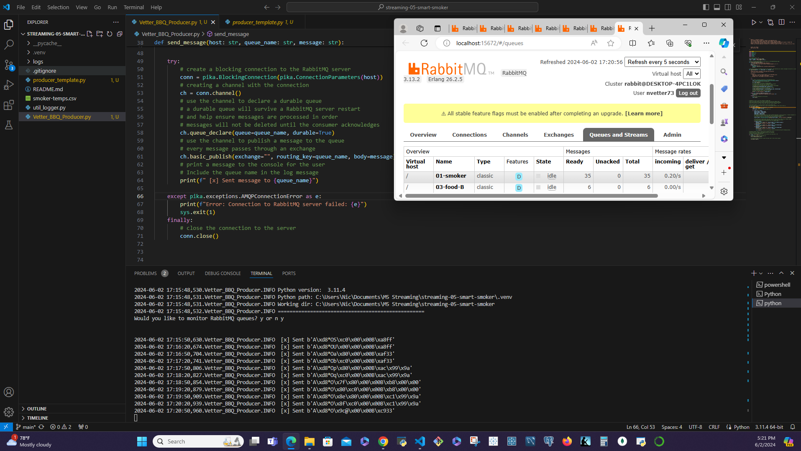
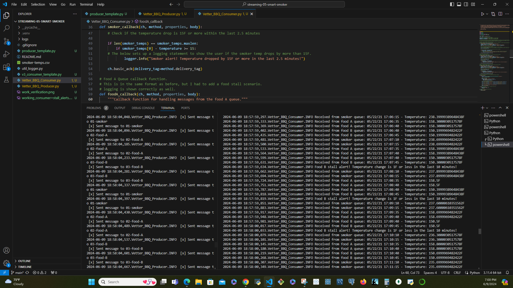

# streaming-05-smart-smoker
# Author: Nic Vetter
## Module 5&6: Creating a Producer

Throughout this module, I will create a producer using python and RabbitMQ. 

This will show skills in data streaming and the ability to understand python related to streaming analytics. 

I will also be working with RabbitMQ as a "broker" to successfully produce messages to queues based on criteria. 

I hope you enjoy my project and have a great day!

# Project Description Below:

We want to stream information from a smart smoker. Read one value every half minute. (sleep_secs = 30)

smoker-temps.csv has 4 columns:

[0] Time = Date-time stamp for the sensor reading
[1] Channel1 = Smoker Temp --> send to message queue "01-smoker"
[2] Channel2 = Food A Temp --> send to message queue "02-food-A"
[3] Channel3 = Food B Temp --> send to message queue "03-food-B"
Requirements

RabbitMQ server running
pika installed in your active environment

# Setting up Environment

In GitHub, create a new repo for your project - name it streaming-05-smart-smoker
Add a README.md during the creation process. (If not, you can always add it later.)
Clone your repo down to your machine. 
In VS Code, add a .gitignore (use one from an earlier module), start working on the README.md. Create it if you didn't earlier.
Add the csv data file to your repo. 
Create a file for your bbq producer.

# Task 2. Design and Implement Your Producer

Implement your bbq producer. More detailed help provided in links below. 
Use the logic, approach, and structure from Module 4, version 2 and version 3.
These provide a current and solid foundation for streaming analytics - modifying them to serve your purpose IS part of the assignment.
Do not start from scratch - do not search for code - do not use a notebook.
Use comments in the code and repo to explain your work. 
Use docstring comments and add your name and date to your README and your code files. 
Explain your project in the README. Include prerequisites and how to run your code. 
Document your project works - display screenshots of your console and maybe the RabbitMQ console. 
If you only have a producer, you won't have a consumer showing messages yet, so you'll need to be creative. We'll build the consumers next.

# Requirements:

Use your Module 4 projects (Version 2 and Version 3) as examples.
Remember: No prior coding experience is required to take this course. Rely heavily on the working examples from earlier modules. 
The more similar your code looks to the examples - the more credit earned.
Vastly different approaches can be expected to earn less credit not more.
This project should clearly build on skills and code we've already mastered. If not, let me know and more help will be provided. 
The primary difference should be going from 1 to 3 queue_names and from 1 to 3 callbacks. 
Part of the challenge is to implement analytics using the tools and approach provided (don't significantly refactor the codebase during your first week of work!) 
AFTER earning credit for the assignment, THEN create and share additional custom projects. 

# Screenshot Verification of Working Custom Producer:

# Module 6 - Custom Consumer with 3 callback functions

In Module 5, we understood the process, designed our system, and implemented the producer. In this Module 6, we'll add the consumers, implementing analytics based on a rolling window of time, and raise an alert when interesting events are detected. 

Please read and follow the guidelines below.

# M6 Requirements below:

We want know if:

The smoker temperature decreases by more than 15 degrees F in 2.5 minutes (smoker alert!)
Any food temperature changes less than 1 degree F in 10 minutes (food stall!)
Time Windows

Smoker time window is 2.5 minutes
Food time window is 10 minutes
Deque Max Length

At one reading every 1/2 minute, the smoker deque max length is 5 (2.5 min * 1 reading/0.5 min)
At one reading every 1/2 minute, the food deque max length is 20 (10 min * 1 reading/0.5 min) 
Condition To monitor

If smoker temp decreases by 15 F or more in 2.5 min (or 5 readings)  --> smoker alert!
If food temp change in temp is 1 F or less in 10 min (or 20 readings)  --> food stall alert!

# M6 Tasks Completed below:

Task 1. Open Your Existing Project
On your machine, open your existing streaming-05-getting-started repo in VS Code.
Create a file for your consumer (or 3 files if you'd like to use 3 consumers).
 

Task 2. Design and Implement Each Consumer
Design and implement each bbq consumer. You could have one. You could have 3.  More detailed help provided in links below. 
Use the logic, approach, and structure from prior modules (use the recommended versions).
Modifying them to serve your purpose IS part of the assignment.
Do not start from scratch - do not search for code - do not use a notebook.
Use comments in the code and repo to explain your work. 
Use docstring comments and add your name and date to your README and your code files. 
 

Task 3. Professionally Present your Project
Explain your project in the README.
Include your name, date.
Include prerequisites and how to run your code. 
Explain and show how your project works. 
Tell us what commands are needed. Use code fencing in GitHub or backtics for inline code to share commands.
Display screenshots of your console with the producer and consumer running.
Display screenshots of at least one interesting part of the RabbitMQ console. 

# M6 Screenshot of working Consumer with Alerts below:

-Nic Vetter
